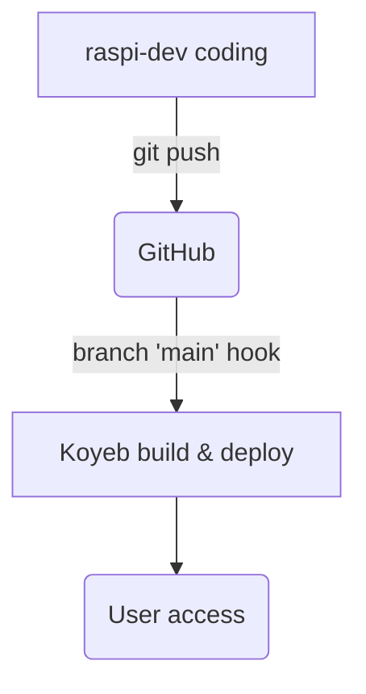

````markdown
# MoneyFlow Mirror · Deployment Guidelines
*A concise, platform‑agnostic checklist so any CI/IaC “agent” can ship the project without guess‑work.*

> **Target stack**
> * **Runtime:** Django 4 + Gunicorn (Python 3.11)
> * **Platform:** Koyeb – Free Web Service (512 MB RAM)
> * **Database:** Koyeb – Free PostgreSQL (1 GB)
> * **Object storage:** Cloudflare R2 (10 GB) via **django‑storages**
> * **Container:** Docker (plus optional *docker‑compose* for local dev)

---

## 1 · Prerequisites

| Tool / Account | Why it’s needed |
|----------------|-----------------|
| GitHub repo with **Dockerfile** & `requirements.txt` | Koyeb auto‑builds from Git |
| Cloudflare account with **R2** enabled | Stores user uploads/exports |
| Koyeb account (Starter plan) | Free compute & Postgres |
| `python-dotenv` (local) | Loads `.env` for dev |
| (Optional) `AWS CLI` | Test R2 uploads from CLI |

---

## 2 · Repository layout

```text
billetera/
├── billetera/            # Django project root (settings.py, wsgi.py)
├── apps/                 # gastos, ingresos, users …
├── static/               # pre‑built Tailwind/Bootstrap assets
├── templates/            # HTML templates
├── Dockerfile            # ← required by Koyeb
├── requirements.txt      # ← required
└── README.md
````

---

## 3 · Environment variables (single source of truth)

| Key                       | Local `.env`           | Koyeb value                                  | Notes                           |
| ------------------------- | ---------------------- | -------------------------------------------- | ------------------------------- |
| `SECRET_KEY`              | placeholder            | random 50 chars                              | never in repo                   |
| `DEBUG`                   | `1`                    | `0`                                          | must be string                  |
| `DATABASE_URL`            | `sqlite:///db.sqlite3` | URL given by Koyeb                           | parsed by **dj\_database\_url** |
| `ALLOWED_HOSTS`           | `*`                    | `moneyflow.<org>.koyeb.app`                  | comma‑sep list                  |
| `AWS_ACCESS_KEY_ID`       | —                      | R2 access key                                |                                 |
| `AWS_SECRET_ACCESS_KEY`   | —                      | R2 secret key                                |                                 |
| `AWS_STORAGE_BUCKET_NAME` | —                      | `moneyflow-media`                            |                                 |
| `AWS_S3_ENDPOINT_URL`     | —                      | `https://<account>.r2.cloudflarestorage.com` |                                 |

---

## 4 · Cloudflare R2 bootstrap

1. **Create bucket** → `moneyflow-media`
2. **Create Access Key** → copy *key* & *secret*
3. Note the **Endpoint URL** ― looks like `https://<ACCOUNT_ID>.r2.cloudflarestorage.com`
4. Keep bucket *Private* (signed URLs handled by **django‑storages**).

---

## 5 · Dockerfile (reference)

```dockerfile
FROM python:3.11-slim
WORKDIR /app
COPY requirements.txt .
RUN pip install --no-cache-dir -r requirements.txt
COPY . .
ENV PORT=8000
CMD ["gunicorn", "billetera.wsgi", "--bind", "0.0.0.0:${PORT}"]
```

*No extra ENTRYPOINT: Koyeb exports `$PORT` automatically.*

---

## 6 · Koyeb deployment steps

1. **Create App** → name it `moneyflow`
2. **Service**

   * **Source:** GitHub → branch `main`
   * **Build type:** *Dockerfile*
   * **Instance:** `free` (512 MB)
3. **Add Database** → PostgreSQL *Free Plan* → copy `DATABASE_URL`.
4. **Environment** → paste all vars from table §3.
5. **Build command** *(optional but handy)*:

   ```bash
   python manage.py migrate --noinput && \
   python manage.py collectstatic --noinput
   ```
6. **Deploy** → wait for *Service Healthy*.
7. Open `https://moneyflow.<org>.koyeb.app`.

---

## 7 · Local dev on Raspberry Pi 4

```bash
# one‑time setup
python3 -m venv .venv && source .venv/bin/activate
pip install -r requirements.txt
cp .env.pi.example .env   # DEBUG=1, SQLite by default

# run
python manage.py migrate
python manage.py runserver 0.0.0.0:8000
```

*Switch to Postgres locally just by changing `DATABASE_URL`.*

---

## 8 · CI / release flow



*Keep an extra branch (e.g. `raspi-dev`) for experiments; merge into `main` to trigger production deploys.*

---

## 9 · Maintenance & scaling

| Concern             | Action                                               |
| ------------------- | ---------------------------------------------------- |
| **DB > 1 GB**       | Upgrade Koyeb DB or migrate to Neon / Supabase       |
| **RAM > 512 MB**    | Switch instance type to **Eco** (\~US\$ 1.6 / mo)    |
| **Media > 10 GB**   | R2 paid tier ≈ US\$ 0.015 / GB‑month                 |
| **Background jobs** | Add a Koyeb *worker* or run Celery in same container |

---

## 10 · Troubleshooting checklist

| Symptom                 | Quick check                                |
| ----------------------- | ------------------------------------------ |
| **502 Bad Gateway**     | verify `ALLOWED_HOSTS`, inspect Koyeb logs |
| **Media not uploading** | check R2 keys / endpoint / bucket name     |
| **collectstatic fails** | disk quota or wrong path permissions       |
| **Migrations missing**  | ensure build command includes `migrate`    |

---

Happy shipping – this doc equips any agent with **all exact steps** to build, deploy and operate *MoneyFlow Mirror* on the free Koyeb + Cloudflare R2 stack.

```
```
# MoneyFlow Mirror · Deployment Instructions